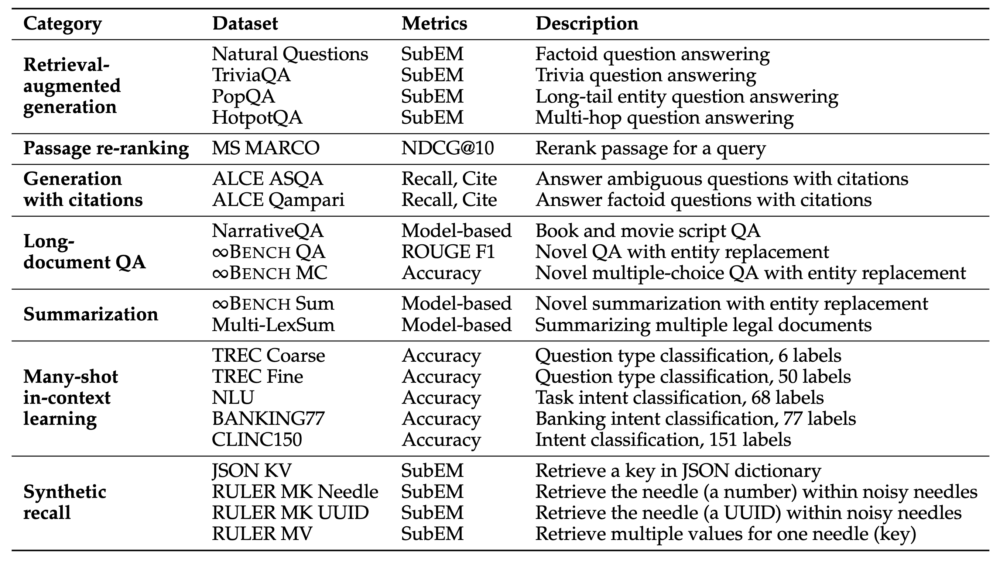
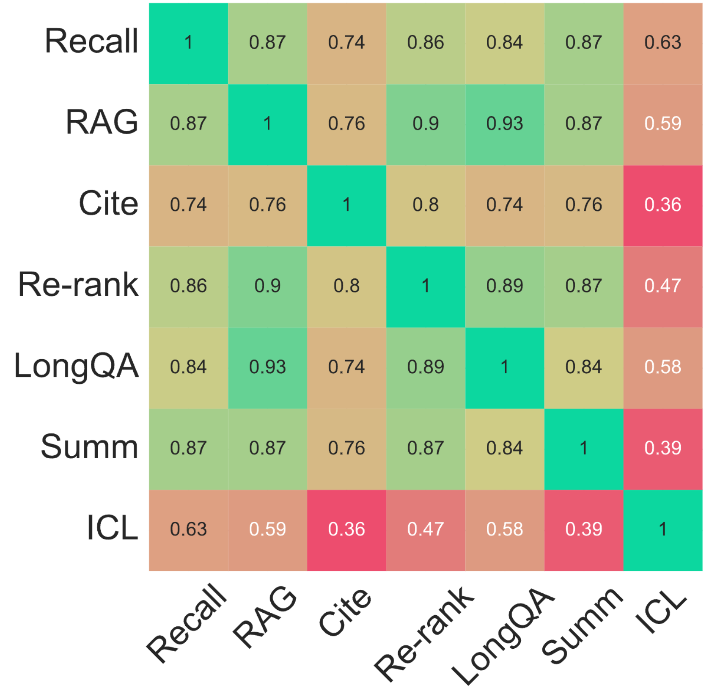

# HELMET: How to Evaluate Long-context Language Models Effectively and Thoroughly 

---

[[Paper](https://arxiv.org/abs/2410.02694)] 

HELMET  (How to Evaluate Long-context Models Effectively and Thoroughly) is a comprehensive benchmark for long-context language models covering seven diverse categories of tasks.
The datasets are application-centric and are designed to evaluate models at different lengths and levels of complexity.
Please check out the paper for more details, and this repo will detail how to run the evaluation.

## Quick Links

- [Setup](#setup)
- [Data](#data)
- [Running evaluation](#running-evaluation)
- [Adding new tasks](#adding-new-tasks)
- [Adding new models](#adding-new-models)
- [Dataset correlation analysis](#dataset-correlation-analysis)
- [Others](#others)
- [Contacts](#contacts)
- [Citation](#citation)

## Release Progress

- [x] HELMET Code
- [x] HELMET data
- [x] VLLM Support
- [ ] Correlation analysis notebook
- [ ] Retrieval setup


## Setup

Please install the necessary packages with
```bash
pip install -r requirements.txt
```

Additionally, if you wish to use the API models, you will need to install the package corresponding to the API you wish to use
```bash
pip install openai # OpenAI API
pip install anthropic # Anthropic API
pip install google-generativeai # Google GenerativeAI API
pip install together # Together API
```
You should also set the environmental variables accordingly so the API calls can be made correctly. To see the variable that you should set up, check out `model_utils.py` and the corresponding class (e.g., `GeminiModel`).

## Data



You can download the data with the script:
```bash
bash scripts/download_data.sh
```
This will first download the .tar.gz file and then decompress it to the `data` directory.

The data is hosted on this Huggingface [repo](https://huggingface.co/datasets/princeton-nlp/HELMET), which stores our preprocessed data in jsonl files and is about 34GB in storage.
For Recall, RAG, Passage Re-ranking, and ALCE, we either generate the data ourselves or do retrieval, so these are stored in jsonl files, whereas our script will load the data from Huggingface for the other tasks, LongQA, Summ, and ICL.
The data also contains the key points extracted for evaluating summarization with model-based evaluation.

In the future, we will add support for simply loading from Huggingface with all the input-outputs formatted, so you can plug in your own evaluation pipeline easily, stay tuned!


## Running evaluation

To run the evaluation, simply use one of the config files in the `configs` directory, you may also overwrite any arguments in the config file or add new arguments simply through the command line (see `arguments.py`):
```bash
python eval.py --config configs/cite.yaml --model_name_or_path {local model path or huggingface model name} --output_dir {output directory}
```
This will output the results file under the output directory. 
We recommend simply using the model name as the output directory: `--output_dir output/Llama-3.2-1B` for example.

You may also run the whole suite with a simple bash statement:
```bash
bash scripts/run_eval.sh
```
Check out the script file for more details!
See [Others](#others) for the slurm scripts, easily collecting all the results, and using VLLM.

The full results from our evaluation are [here](https://docs.google.com/spreadsheets/d/1LBt6dP4UwZwU_CjoYhyAd_rjKhQLvo0Gq4cYUnpi_CA/edit?usp=sharing).

### Model-based evaluation

To run the model-based evaluation for LongQA and Summarization, please make sure that you have set the environmental variables for OpenAI so you can make calls to GPT-4o, then you can run:
```bash
python scripts/eval_gpt4_longqa.py
python scripts/eval_gpt4_summ.py

# Alternatively, if you want to shard the process
bash scripts/eval_gpt4_longqa.sh
bash scripts/eval_gpt4_summ.sh
```

To specify which model/paths you want to run model-based evaluation for, check out the python scripts and modify the `model_to_check` field.
You may also use Claude, Gemini, or other models for model-based evaluation by modifying the class but we have tested for `gpt-4o-2024-05-13`.

## Adding new models

The existing code supports using HuggingFace-supported models and API models (OpenAI, Anthropic, Google, and Together). To add a new model or use a different framework (other than HuggingFace), you can modify the `model_utils.py` file.
Specifically, you need to create a new class that implements `prepare_inputs` (how the inputs are processed) and `generate` functions. Then, you can add a new case to `load_LLM`.
Please refer to the existing classes for examples.


## Adding new tasks

To add a new task/dataset, you just need to modify the `data.py` file:

Create a function that specifies how to load the data:
1. Specify the string templates for the task through `user_template`, `system_template`, and `prompt_template` (which is usually just the concatenation of the two)
2. Process each sample to fit the specified templates (the tokenization code will call `user_template.format(**test_sample)` and same for `system_template`). Importantly, each sample should have a `context` field, which will be truncated automatically if the input is too long (e.g., for QA, this is the retrieved passages; for NarrativeQA, this is the book/script). You should use the `question` and `answer` field to make evaluation/printing easier.
3. Optionally, add a `post_process` function to process the model output (e.g., for MS MARCO, we use a ranking parse function; for RULER, we calculate the recall). There is also a `default_post_process` function that parses and calculate simple metrics like EM and F1 that you may use. This function should take in the model output and the test sample and return a tuple of `(metrics, changed_output)`, the `metrics` (e.g., EM, ROUGE) are aggregated across all samples, and the `changed_output` are added to the test_sample and saved to the output file.
4. The function should return `{'data': [list of data samples], 'prompt_template': prompt_template, 'user_template': user_template, 'system_template': system_template, 'post_process': [optional custom function]}`.

Finally, simply add a new case to the `load_data` function that calls the function that you just wrote to load your data.
You can refer to the existing tasks for examples (e.g., `load_json_kv`, `load_narrativeqa`, and `load_msmarco_rerank`).


## Dataset correlation analysis 



We also analyze the correlation between performance on different datasets.
The code will be released soon.

## Others

<details>

<summary>Collecting results</summary>
To quickly collect all the results, you can use the script:
```bash
python scripts/collect_results.py
```
Please check out the script and modify the specific fields to fit your needs.
For example, you can change the models, task configs, output directories, tags, and more.

</details>

<details>

<summary>Slurm scripts</summary>

I have also included the slurm scripts for running all the experiments from the paper.
You can run the scripts with:
```bash
sbatch scripts/run_eval_slurm.sh
sbatch scripts/run_short_slurm.sh
sbatch scripts/run_api.sh
```
Note that you may need to modify the script to fit your cluster setup.
For example:
 - `--array 0-1` specifies the number of jobs to run, this index corresponds to the model index in the array.
 - You may also specify which set of models to run with `MNAME="${S_MODELS[$M_IDX]}"` or `MNAME="${L_MODELS[$M_IDX]}"` for the short and long models respectively.
 - `--gres=gpu:1` specifies the number of GPUs you want to use, for the larger models, you may need more GPUs (we use up to 8x80GB GPUs).
 - `--mail-user` specifies the email address to send the job status to.
 - `source env/bin/activate` specifies the virtual environment to use.
 - `MODEL_NAME="/path/to/your/model/$MNAME"` you should specify the path to your model here.

</details>

<details>

<summary>Using VLLM</summary>

To use VLLM to run the evaluation, you can simply add the `--use_vllm` flag to the command line like so:
```bash
python eval.py --config configs/cite.yaml --use_vllm
```
Disclaimer: 
VLLM can be much faster than using the native HuggingFace generation; however, we found that the results can be slightly different, so we recommend using the native HuggingFace generation for the final evaluation.
All reported results in the paper are from the native HuggingFace generation.
The speedup is much more noticable for tasks that generates more tokens (e.g., summarization may see up to 2x speedup), whereas the speedup is less noticable for tasks that generate fewer tokens (e.g., JSON KV may see less than 5% speedup).

</details>


## Contacts

If you have any questions, please email me at `hyen@cs.princeton.edu`.
If you encounter any problems, you can also open an issue here. Please try to specify the problem with details so we can help you better and quicker!

## Citation

If you find our work useful, please cite us:
```
@misc{yen2024helmetevaluatelongcontextlanguage,
      title={HELMET: How to Evaluate Long-Context Language Models Effectively and Thoroughly}, 
      author={Howard Yen and Tianyu Gao and Minmin Hou and Ke Ding and Daniel Fleischer and Peter Izsak and Moshe Wasserblat and Danqi Chen},
      year={2024},
      eprint={2410.02694},
      archivePrefix={arXiv},
      primaryClass={cs.CL},
      url={https://arxiv.org/abs/2410.02694}, 
}
```
