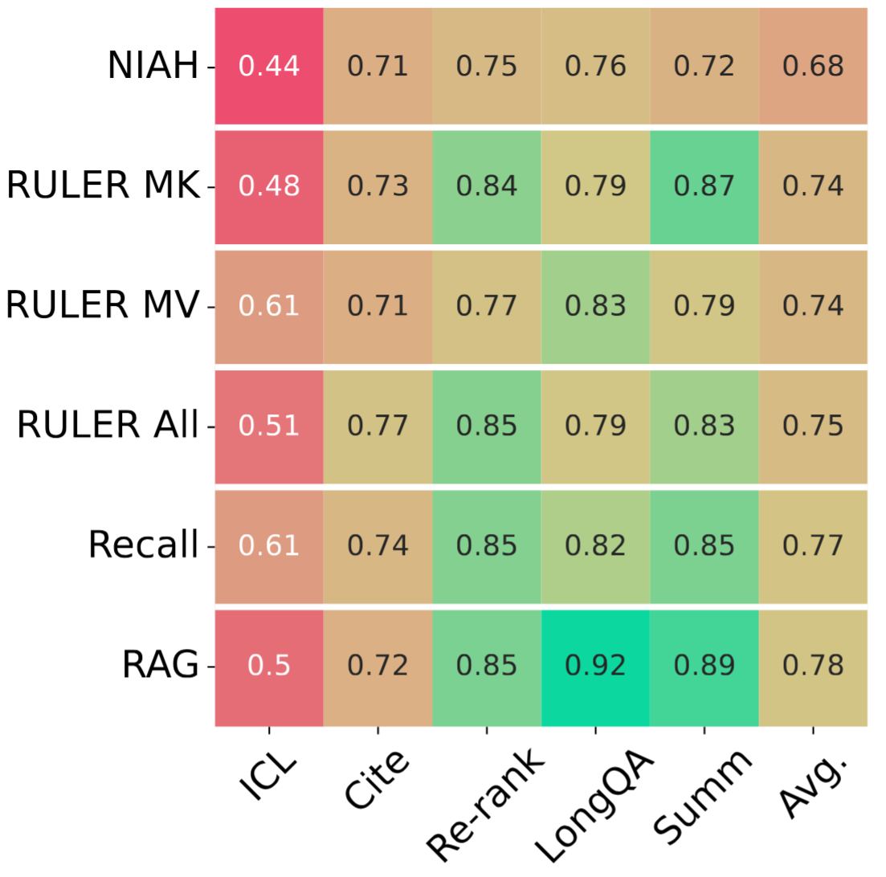

# HELMET: How to Evaluate Long-Context Language Models Effectively and Thoroughly

By [Howard Yen](howard-yen.github.io)

Paper: https://arxiv.org/abs/2410.02694 \
Code & Data: https://github.com/princeton-nlp/HELMET \
Website: https://princeton-nlp.github.io/HELMET

- [HELMET: How to Evaluate Long-Context Language Models Effectively and Thoroughly](#helmet-how-to-evaluate-long-context-language-models-effectively-and-thoroughly)
  - [Background](#background)
  - [Building HELMET](#building-helmet)
    - [Task construction](#task-construction)
    - [Reliable evaluation](#reliable-evaluation)
    - [Better prompting and controllability](#better-prompting-and-controllability)
  - [Analysis](#analysis)
    - [Simple synthetic tasks are poor predictors of real-world performance](#simple-synthetic-tasks-are-poor-predictors-of-real-world-performance)
    - [Diverse LCLM applications call for diverse evaluation](#diverse-lclm-applications-call-for-diverse-evaluation)
    - [Model performance across tasks and lengths](#model-performance-across-tasks-and-lengths)
  - [Conclusion](#conclusion)
  - [Future work](#future-work)

From summarizing numerous legal documents to learning new tasks on the fly, long-context language models (LCLMs) have immense potential to change the way we use and interact with language models.
With the recent excitement around LCLMs, many model developers have released new models with longer and longer context windows.
However, existing benchmarks for long-context language modeling primarily rely on either perplexity and synthetic tasks, such as needle-in-a-haystack, even though it is unclear how well the performance on these tasks would transfer to real-world applications. 

In this work, we propose HELMET (How to Evaluate Long-Context Models Effectively and Thoroughly), a comprehensive benchmark for evaluating LCLMs.
In contrast to previous benchmarks, HELMET is designed to include diverse, application-centric tasks, complemented with reliable evaluation settings. 
We evaluate over 50 recent models, enabling detail comparisons and understanding of existing models and architectures across diverse axes.
Our experiments reveal key findings: (1) synthetic tasks like needle-in-a-haystack (NIAH) do not reflect real-world performance, (2) diverse types of tasks exhibit distinct trends, and (3) open-source models still lag behind proprietary models on more complex tasks.
Ultimately, we advocate for a holistic evaluation across diverse tasks.

## Background

There has been a surge of interest in LCLMs in the recent years—companies are building frontier models (e.g., GPT-4, Claude, and Gemini) with longer and longer context lengths (up to millions of tokens) and researchers are exploring new models architectures and techniques to improve these models.
Consequently, there is a need for benchmarks that can effectively evaluate these models.
A popular approach to evaluate these models is through perplexity [can cite some works here like Fu et al.], but recent works showed that perplexity does not correlate well with downstream performance [cite].
Another approach is to use synthetic tasks, such as NIAH, which are easy to generate and evaluate. However, as we will show in this work, these tasks do not capture the complexity of real-world applications, and thus do not reflect models' true capabilities in realistic settings. 

Despite the development of new long-context benchmarks, frontier LCLMs mostly rely on synthetic tasks or arbitrary subsets of other benchmarks for evaluation [add table 1 here?].
This complicates the comparison between different models and makes it difficult to understand the strengths and weaknesses of each model.
Existing benchmarks still suffer from the following design flaws:
- Insufficient coverage of downstream tasks: most benchmarks focuses on synthetic tasks or specific applications (e.g., question answering, summarization). 
- Inadequate lengths: most natural language datasets are too short for testing frontier LCLMs, which usually have context lengths >= 128k tokens.
- Unreliable metrics: existing benchmarks rely on n-gram based metrics, such as ROUGE, which can be noisy and unreliable.
- Incompatibility with base models: LCLM development often focuses on base models, but most benchmarks require the model to be instruction-tuned.

As a result, model developers do not agree on these evaluation settings.
We evaluate leading LCLMs on benchmarks that support 128k context lengths—NIAH, RULER, and InfiniteBench—and found that they show counterintuitive results.
Specifically, smaller models (Llama-8B) outperform larger models (Llama-70B) on these benchmarks, which contradicts previous findings [cite gemini here] as well as common beliefs in the community.

## Building HELMET

To address the aforementioned limitations of existing benchmarks, we design HELMET with the following desiderata:
<!-- Desiderata: -->
1. Diverse coverage of downstream tasks
2. Controllable length and complexity
3. Reliable evaluation for base and instruction-tuned models

In the following section, we will first describe the construction of HELMET, followed by the improved evaluation settings. 

### Task construction

- Retrieval-augmented generation (RAG): RAG is one of the most popular application of language models, and long-context models have the potential to process large amounts of retrieved information. To this end, we leverage open-domain question answering datasets to test model in RAG settings. The input consists of a question and k retrieved passages, one of which contains the answer while the rest are distractors. The model is tasked with generating the answer to the question.
- Passage re-ranking (Re-rank): Re-ranking retrieved passage based on their relevance to the query is a critical part of the RAG pipeline and, thus, an important application of LCLMs. Given a query and a set of retrieved passages, the model outputs a ranking of the passages.
- Generation with citations (Cite): In addition to question answering with retrieved information, we may want the model to follow other instructions at the same time, such as citing its sources. We use subsets of ALCE (Gao et al., 2023) to test models' ability to answer complex questions and attribute their answers to the context. The context includes a multi-faceted question and k retrieved passage. This task requires the model to reason over a large number of passages *and* follow follow the citation formatting.
- Long-document question answering (LongQA):  The input consists of a question and a long document (e.g., a novel), and the model needs to generate the answer. For the datasets with longer answers, we employ a model-based evaluation metric that are more reliable than the traditional n-gram based metrics.
- Summarization (Summ): As a popular task for testing LCLMs, summarization requires the model to aggregate information across the input text and generate a concise summary. In our chosen datasets, the input consists of either multiple formal legal documents (Multi-LexSum; Shen et al., 2022) or a long book (InfiniteBench Summ; Zhang et al., 2024). We also design robust model-based evaluation for the model outputs. 
- Many-shot in-context learning (ICL): Language models adapts to new tasks through in-context learning. Long-context inputs enables models to learn from more examples, and we test existing LCLMs with datasets with large label spaces. Notably, we map the labels to random integers to prevent models from memorizing the labels.
- Synthetic recall (Recall): Synthetic tasks are effective for stress testing models on precise information retrieval from long contexts. Due to their ease of controllability and evaluation, we include synthetic tasks that are correlates well with realistic applications (see the results for more information.).

A summary of the benchmark is shown in table above and more details can be found in the paper.

### Reliable evaluation

A key flaw of many existing benchmarks is the reliance on n-gram based metrics, such as ROUGE, for open-ended tasks like summarization, despite their known poor correlation with human judgments (Goyal et al., 2023).
In HELMET, we address these issues with model-based metrics for tasks with open-ended answers, such as LongQA and Summ.

For LongQA, we prompt GPT-4o to evaluate model responses on fluency and correctness.
Inspired by previous works on model judges, we give the judge detailed rubrics and few-shot examples to ensure consistent evaluation.
The final score is the product of the fluency and correctness scores, normalized between [0, 100].

For Summ, we similarly check if the model output is fluent (0 or 1).
Then, we decompose the reference summary into atomic claims and prompt GPT-4o to check if each claim is supported by the model summary (recall). 
Then, we check if each sentence in the model response is supported by the gold summary (precision). 
After computing the F1 score, we take its product with the fluency score as the final score.

Compared to n-gram based metrics, our model-based metrics reflects more consistent trends:
- Llama-3.1-8B-Inst achieves similar ROUGE scores to GPT-4o on both summarization datasets, while our model-based metrics show that GPT-4o outperforms Llama by a large margin.
- Model-based metrics are better at identifying incoherent generations and shows lower performance for models with smaller context windows (e.g., Mistral-v0.3).
- GPT-4o exhibits a positive trends with increasing input lengths, while ROUGE remains within a difference of 2 absolute points.

Furthermore, we conducted humans studies and found that our new metrics achieve high agreement with human judgments—our metric has a Cohen's Kappa = 0.91 and Kappa=0.76 on summary precision and recall.

### Better prompting and controllability 

**Robust prompting**: Existing long-context benchmarks often require models to follow instructions, which means they only apply to instruction-tuned models (Shaham et al., 2023). However, many model developments revolve around base models, which has to rely on synthetic tasks or perplexity for evaluation.
Thus, we support base models for a subset of our tasks.
Existing benchmarks mostly use zero-shot prompting (Shaham et al., 2023; Zhang et al., 2024), which often leads to noisy output formats; by adding two-shot demonstrations to the prompt, we observe that base models substantially improve their performance on our tasks, which is also a better reflection of how the models are used in real-world applications.

**Controllable length and difficulty**:
An important dimension to consider when evaluating LCLMs is the input length, as longer inputs can provide more information while challenging the model's ability to process noisy contexts.
In our tasks, we can control the input length by changing the number of retrieved passages (RAG, Cite, Re-rank), the number of demonstrations (ICL), or the length of the input document (LongQA, Summ).
Although LongQA and Summ can not be easily extended to longer contexts, we intentionally chose datasets with natural documents of length far greater than 100k tokens, such that they can still be used to evaluate frontier LCLMs.

## Analysis

With the release of numerous long-context language models, it may be difficult discerning their differences given the stark difference in the evaluation settings.
Furthermore, it's often unclear how these models will perform on specific applications, as most benchmarks often focus on synthetic tasks or specific applications.
In this work, we evaluate a comprehensive set of 51 models on HELMET.
To our best knowledge, this is the most thorough and controlled comparison of long-context models on diverse applications.
These models cover both leading proprietary and open-source models.
We also consider models with different architectures (e.g., full-attention transformers, hybrid architectures) and positional extrapolation techniques.
In this section, we will highlight a few key findings from our experiments.

### Simple synthetic tasks are poor predictors of real-world performance

One of the most popular task for evaluating LCLMs is the needle-in-a-haystack (NIAH) task and its many variants.
However, there has been no systematic evaluation of how well these synthetic tasks correlate with real-world performance.
In the following figure, we plot their Pearson rank correlation with real-world tasks in HELMET.

<!--  -->

The most simple synthetic task—NIAH—has the lowest correlation with real-world tasks, while the more complex variants (e.g., RULER MK) have higher correlation.
The tasks with noisier, more distracting contexts are better at differentiating models, as the performance are less likely to be concentrated at 100% accuracy.
In contrast, a more realistic task, such as RAG, has much higher correlation with the real-world tasks.
Thus, **RAG is a better proxy for real-world tasks**. 

<!-- ### RAG is a better proxy for real-world tasks -->

### Diverse LCLM applications call for diverse evaluation

Long-context benchmarks are often constructed with specific applications in mind, such as summarization or question answering, which limits the understanding of LCLMs in a broader context.
We examine model performance over a wide range of real tasks, and find that different categories do not always correlate with each other, as shown in the following figure.

While some tasks moderately correlate with each other (e.g., RAG and MS-MARCO) due to their retrieval-based nature, others show little correlation (e.g., Summ and Cite).
Notably, ICL has the lowest correlation with other tasks, which suggests that it is a unique task that requires different capabilities from the model.
Therefore, model developers should evaluate across these distinct axes to draw a more holistic picture of the model's capabilities.

### Model performance across tasks and lengths

We present the results of the frontier proprietary models as well as a few open-source models on HELMET.
Additional results can be found in the paper and the website.

First, we observe that **open-source models lag behind closed-source models on complext tasks**.
Although the gap appears to small on more simple tasks, such as Recall, the gap widens on more complex ones, such as Cite.

Furthermore, **performance degradation with increasing lengths is category-dependent**. Even the most advanced models, such as GPT-4o and Gemini, experience significant decrease in performance on tasks like re-ranking. 
This change in performance cannot be observed from simply looking at the synthetic task performance.

Finally, **there is no clear winner across all categories**, thereby calling for evaluation across different axes.
Additional analysis, such as performance of different positional extrapolation methods and the lost-in-the-middle phenomenon, can be found in the paper.

## Conclusion

In this work, we propose HELMET for evaluating long-context language models.
We test over 50 models on diverse tasks and lengths, and reveal key findings for the current state of LCLMs—it is crucial to test models on diverse applications to understand their capabilities.
We hope that our benchmark will be useful for future development.

## Future work

HELMET is a step towards a more comprehensive evaluation of long-context language models, but there are still many exciting applications of LCLMs that we have not yet considered.
We recently released [LongProc](https://arxiv.org/abs/2501.05414), a benchmark for evaluating LCLMs on *long-form generation* and *following procedures*.
Although summarization tasks in HELMET have long outputs (up to 1k tokens), LongProc focuses on even longer outputs, up to 8k tokens.
Similar to HELMET, LongProc is also designed with reliable evaluation settings and diverse tasks.
We are working on integrating LongProc into HELMET's evaluation suite, and we hope that this will provide a more comprehensive evaluation of LCLMs on long-form tasks.
